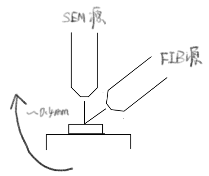
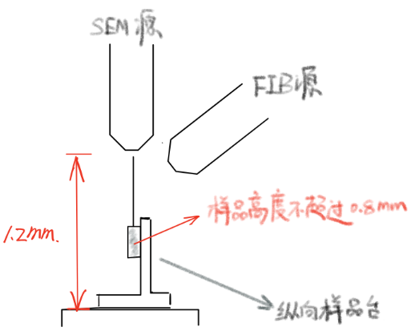

+++
date = '2024-12-17'
draft = false
title = 'FIB SEM测厚'
tags = ['Science', 'Activation']
+++

绝对测量550μg/cm²靶厚，预估699nm
# 原子力显微镜AFM类设备
700nm厚度样品固定在衬底上，厚度当作表面起伏测量。

测量样品上表面与衬底的高度差。

台阶仪 > AFM > 压电台机械臂

无损，精度受衬底影响。

AFM探针的精度是~10 nm，但是难点在于不增加高度的条件下固定样品。

低成本。

# FIB - SEM 集成

1. SEM对焦
2. 旋转样品台与FIB源垂直
3. FIB切割截面
4. SEM观察，三角函数计算厚度

需要切割至少600*600nm的方形空间

切割与探测精度：10 nm

微纳尺度破坏，1-2 μm，包含离子注入污染范围。

报价2000/h，切割测量一片需要大约2min

# 只使用SEM

不开FIB聚焦离子束

只使用SEM升降样品台对焦。

样品尺寸最大不能超过0.8mm

探测精度同样为：10 nm
需要进行宏观层面的破坏

需要注意破坏方法，直接剪开可能由于剪切造成金属延展。

只能测量边缘位置的厚度。

报价2000/h

# 联系
中科院物理所，金爱子

82648198

azjin@iphy.ac.cn

M楼超净间千级区
