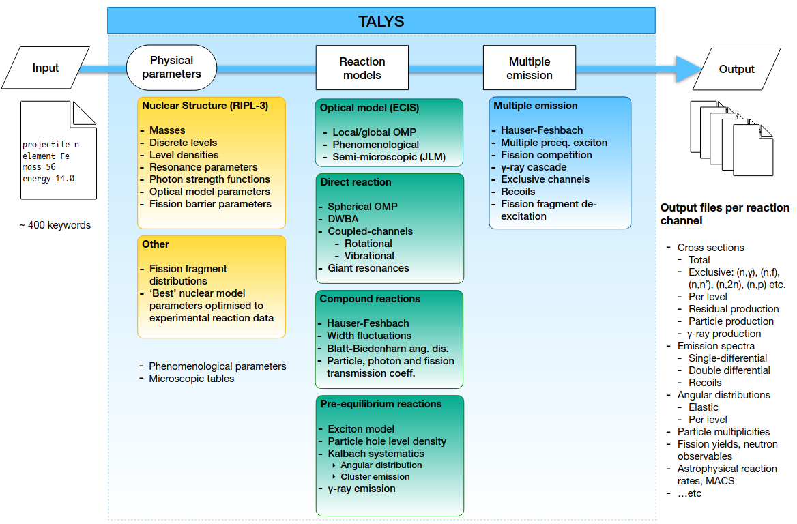

+++
date = '2025-01-03'
draft = true
title = 'Talys'
tags = ['Science', 'Talys']
+++

ref: Arjan Koning, IAEA
ref: https://doi.org/10.1140/epja/s10050-023-01034-3
# Talys
- Computer program to simulate nuclear reactions
- Used for fundamental nuclear physics research
- Used to produce nuclear data for applications
- Projectiles: neutron, photon, proton, deuteron, triton, Helium-3, alpha particle;
	- Also works for an excited nucleus as initial condition
- Targets: Z= 3-124, A=5-339
	- Reliability: Z > 9, A > 20
	- Also a natural element can be specified
- Incident energy: 1 meV - 1 GeV
	- Reliability: few keV - 200 MeV


# Input Discription
Minimal input file:(Also others parameters)
```Talys
projectile n 
element al 
mass 27 
energy 14
```
## Basic input rools
1. One input line contains one keyword./
2. A keyword and its value(s) must be separated by at least 1 blank character.
3. The keywords can be given in arbitrary order.
4. All characters can be given in either lowercase or uppercase.
5. A keyword must be accompanied by a value.
6. An input line starting with a # in column 1 is neglected by TALYS.
7. A minimal input file always consists of 4 lines and contains the keywords projectile, element,  mass and energy. These 4 keywords must be given in any input file.
keywords are listed in manual part III