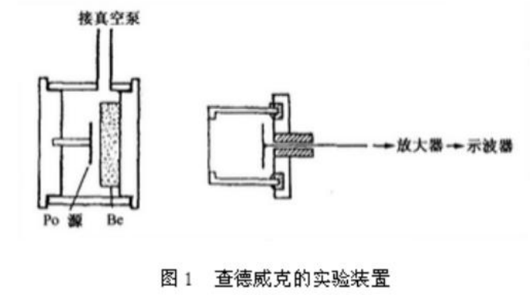
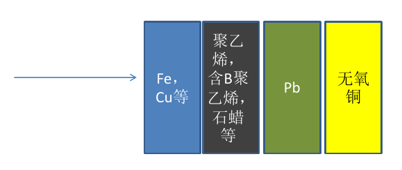

+++
date = '2022-11-17'
draft = false
title = '中子物理'
tags = ['Science', 'Neutron']
+++

- 考试复习
- # 第一章:绪论
    - 1.了解中子发现的历史,Chadwick通过什么样的实验发现了中子?
        - 在电离室里充不同的气体,利用alpha打Be靶产生的射线去打不同的物质,根据产生的反冲能量,准确推出射线的质量为接近于质子的质量(1.008倍质子的质量),从而确定了中子的存在。
            
          自此,人类认识到原子核中心有核,是由质子和中子组成的,核外是电子。  
          
        - 1932年,英国物理学家J. Chadwick发现中子;
          1920年,卢瑟福预言中子的存在:如果原子核里只有质子,则核电荷数与核外电子不符,预研存在中性粒子-中子;  
          1930年,柏林德国皇家物理技术研究所的玻特(W. Bothe)和巴黎居里镭学研  
          究所的伊伦.居里和约里奥利用alpha打Be靶,发现了穿透力很强的辐射,他们都认为是伽马;伊伦.居里和约里奥还利用alpha打Be靶产生的中子打石蜡,获得了质子束(反冲质子),可惜没有想到是中子;  
          1930年,柏林德国皇家物理技术研究所的玻特(W. Bothe)和巴黎居里镭学研  
          究所的伊伦.居里和约里奥利用alpha打Be靶,发现了穿透力很强的辐射,他们都认为是伽马;伊伦.居里和约里奥还利用alpha打Be靶产生的中子打石蜡,获得了质子束(反冲质子),可惜没有想到是中子;  
          1932年, J. Chadwick根据前人的成果,经过自己的实验,判断alpha打Be靶产生的射线是中子;  
          1935年获得诺贝尔奖;  
          中子的发现深刻改变了核物理的发展,也改变了世界。  
    - 2.重点了解中子的基本性质:质量、自旋、磁矩、寿命等
        - 质量 $m_n=1.008664924\mathrm{u}=1.674953\times 10^{-24}\mathrm{g}=939.6\mathrm{MeV}$
        - 自旋 $\sigma = \frac12$
        - 磁矩 $\mu_n=-1.91304275\mu_N$
        - 寿命 $\tau_n=896\pm 10\mathrm{s}$
- # 第二章：中子源物理
    - 1.给定一些参数(如反应截面、靶参数等),知道如何计算中子强度和产额。
        - 原子数
            $$N=\frac mMN_A$$		
        - 中子产额：单位入射粒子所能产生的中子数,跟反应截面及靶物质量有关
            $$Y=\sigma_{a,n}N_vd$$ 		  
            $N_v$ 是单位体积的靶核数,则 $N_vd$ 即为单位面积的靶核数  
        - 中子强度：单位时间内产生的中子数,单位:n/s，从入射粒子强度 $I_a$ 可求出种子强度
            $$I=I_aY$$	
      - 如:一个氘-氚反应中子源,入射氘能量2.5 MeV,平均束流强度1微安,氚钛靶的质量厚度为1 mg/cm^2(钛的质量厚度),氚/钛比为1.5(每个钛原子可吸附1.5个氚原子),氘氚反应截面为 $\sigma$ mb,求该中子源的强度,如果0度角的微分截面为 $\sigma_0$  mb/sr,则在0度角方向离该中子源10 cm处的中子注量率是多少?(假设Ti的原子量为48)
        - 本题：
        $$1.5\times N_vd=1.5\times \frac{1\times 10^{-3} \mathrm{g/cm^2}}{48 \mathrm{u}}\times N_A$$		
        $$Y=\sigma \times 10^{-27}\times N_vd$$
        $$I_a=\frac{1\times 10^{-6}\mathrm{A}}{1.6\times 10^{-19}}$$ 		  
        此处 $I_a$ 需要根据入射粒子电荷数进一步换算  
        $$I=I_aY$$
        $$\phi=\frac{I_a\sigma_0N_vd}{R^2}$$	
    - 2.同位素、加速器及反应堆中子源各自的特点。可从中子源的主要指标着手去分析。
      collapsed:: true
        - 中子源的主要指标有:
          1)能量(能谱);  
          2)强度和产额;  
          3)角分布;  
          4)伴生伽马本底。  
        - 同位素中子源：强度弱 $<10^7$ ，各向同性，伽玛本底强
          加速器中子源：能谱分布广，各向异性，伽玛本底弱  
          反应堆中子源：热中子 能量高，注量率高，各向同性，伽玛本底强  
    - 3.为什么8-14 MeV能区单能中子源是难点?如何获得8—14MeV能区单能中子源?
      collapsed:: true
        - 常用的中子源(如d-D,p-T反应),入射粒子能量达到一定时,三体反应发生(如D(d,pn)D),出射的中子不再是单能的,而是在低能段有破裂中子的干扰。
        - 重离子打氢：一些常用的H(Hi,n)反应中子源,根据运动学计算,这类中子源通常有两组能量的中子,当低能中子所占份额很少时,可认为是单能中子。
    - 4.什么是白光中子源?主要由哪些反应产生白光中子源?
      collapsed:: true
        - 离子驱动:如氘束打厚7Li或Be靶,质子束打厚7Li或Be靶等,入射粒子能量通常几十MeV,追求大流强(mA)量级,可以达到很高的中子产额;
        - 电子驱动:几十至几百MeV的电子书打重靶(Ta、W、U等),通过光核反应产生从热中子到约10 MeV的白光中子;
        - 散裂中子源:高能强流质子束打重靶(Pb、W、Hg等),通过散裂反应产生从热中子到几百甚至GeV的白光中子。
- # 第三章:中子与原子核的相互作用
    - 1.截面、微分截面及角分布的概念。
        - 截面:反应入射粒子与原子核发生相互作用概率的重要物理量
            $$\sigma = \frac{K}{I\times N}$$ 		
            K:反应率(r/s)或反应数(r);  
          I:入射粒子强度(n/s,n),注量率或注量(n/cm2/s或n/cm2);  
          N:靶核原子数或单位面积的靶核原子数(N/cm2或N)。  
        - 单位:巴(b),豪巴(mb)， $1\mathrm{b}=1\times 10^{-24}\mathrm{cm^2}$
        - 计算时注意:
          I为注量或注量率时(面积量纲),N为靶核数(无面积量纲)  
          I为无面积量纲时,N为单位面积的靶核数(面积量纲)  
        - 微分截面:出射粒子的几率与出射角有关,沿某一个角度出射粒子的几率称为微分截面,单位: b/sr或mb/sr
        $$\mathrm{d}n\left(\theta\right)=\sigma(\theta)\cdot I\cdot N\cdot\mathrm{d}\Omega(\theta)$$
        - 角分布:微分截面随角度变化的关系
        - 以中子与靶核的弹性散射为例,弹性散射截面可通过微分截面角分布积分获得
        $$\sigma_{el}=\int\sigma_{el}\left(\theta\right)\mathrm d\Omega=2\pi\int_0^\pi\sigma_{el}\left(\theta\right)\sin\theta\mathrm d\theta$$
    - 2.中子与原子核会发生哪些主要反应?中子反应截面有哪些特点?
        - 散射：弹性散射、非弹性散射
        - 中子吸收：(n, g) (n, xn) (n, z) (n, f)
        - 反应截面：
        $$\sigma_t=\sigma_s+\sigma_a=\left(\sigma_{el}+\sigma_{inel}\right)+(\sigma_c+\sigma_f)$$	
        - 中子反应截面呈现非常复杂的特性,f分为1/v取，共振取和快区，反应截面与能量和角度有关
    - 3.简述核反应经历哪些阶段?有哪些作用机制?不同机制时其出射粒子的能谱角分布有何特点?
        - 独立粒子阶段：
          入射中子入射到靶核上  
          1)被散射—弹性散射或势散射;  
          2)被吸收。  
        - 复合核形成阶段
          1)直接作用:  
            (1)入射粒子将能量转移给一个或少数几个核子,然后逃逸;  
            (2)入射粒子经过多次碰撞并发射出来;  
            (3)入射粒子部分能量转给靶核后发射出来,靶核被集体激发(转动、振动)  
          2)入射粒子经过多次碰撞后达到平衡,形成复合核,入射粒子不再可分辨;  
        - 最后阶段—复合核衰变
        - 预平衡:介于直接过程与复合核过程的状态
        -
        - 1)在截面的低能部分，复合核机制是主要的，但随着入射能量的增加直接反应的贡献上升以至成为主要的，而复合核的贡献随能量增加而减少，逐渐变得可以忽略
          2出射粒子能谱的低能部分主要是来自复合核的贡献，并且呈 Maxwell类型分布，称为蒸发谱；高能量的出射粒子主要来自直接反应机制，且剩余核处在较低的激发能级上。在这两部分之间的连续区，预平衡阶段的粒子发射起了较好的补充作用  
          3）角分布则更为明显，来自复合核机制的出射粒子角分布呈各向同性或90对称，而直接反应的贡献则是“前冲“的，即在小角度有更高的概率  
- # 第四章:中子探测
    - 1.用于中子探测的核作用有哪些?中子探测方法主要有哪几种?
        - 用于中子探测的核作用基本上有两类:
          1、核散射  
          2、核反应(包括核裂变)  
        - 探测方法主要有下述四种:
          1、核反冲法(快中子，反冲能量A大而小，10MeV以下反冲质子矩形谱)  
          2、核反应法  
          3、核裂变法(裂变放能，无阈裂变热中子，有阈裂变快中子)  
          4、核活化法 $n+^{197}Au\to ^{198}+ \gamma$  
    - 2.常用的用于中子探测的核反应有哪些?他们各自的特点与适用范围是什么?
      collapsed:: true
        - 常用核素:  ^{ 3} He、 ^{ 6} Li、 ^{ 10} B、 ^{ 155} Gd 和 ^{ 157} Gd 等,相应的核反应及其主要特点如下：
            - (1) ^{ 3}He(n,p)^{ 3}H：Q值为0.765MeV,热能点截面5400b。在0.1~1MeV能区可用于中子能谱测量。(天然^{ 3} He的丰度为 $1.4\times 10^{-4}$ %)
            - (2) ^{ 6} Li(n,t)^{ 4}He：Q值为4.78MeV。反应截面在0.001~0.1MeV能区遵循1/v规律;在En≈250keV处有一共振峰,共振处的截面值为3.3b。(^{ 6}Li天然丰度为7.5%)
            - (3) ^{ 10}B(n, $\alpha$ )^{ 7} Li：反应Q值为2.79MeV;反应截面热能点为3840b;热能以上至1keV按1/v变化;反应剩余核只有7%处于基态，其余93%处于激发态。激发态的寿命很短(约为8×10^{ -14}s),通过放出0.478MeV的 $\gamma$ 辐射退激到基态。
            - (4) ^{ 155,157}Gd(n, $\gamma$ )^{ 156,158} Gd：
              ^{ 157}Gd: 丰度15.65%, 热中子俘获截面2.55×10 ^{ 5}b,贡献80%;  
              ^{ 155}Gd: 丰度14.8%,热中子俘获截面6.1×104b,贡献18%.  
              其余: 2%。  
              ^{ 156}Gd* 和^{ 158}Gd * 的总激发能分别为8.53MeV和7.94MeV,主要通过放出级联 $\gamma$ 射线和内转换电子衰变到基态。通过测量它们放出的 $\gamma$ 射线或内转换电子而探测中子。  
    - 3.常用的中子探测器有哪些?
      collapsed:: true
        - 气体探测器;含氢正比管，含BF_{ 3}正比管，^{ 3}He正比管
        - 闪烁探测器; 闪烁体，光电转换器件
        - 望远镜(半导体、闪烁探测器);
        - 裂变室;
        - 活化片;
        - 径迹探测器;(核乳胶和固体径迹探测器等)
    - 4.中子-伽马甄别的主要方法?
      collapsed:: true
        - 带电粒子通过有机闪烁体时,其径迹周围的分子或原子则被激发或电离。处于激发态的分子或原子退激时便放出光。有机闪烁体发光时间很短并以多种衰减时间常数指数下降。
        - 发光衰减时间的快成份的衰减时间常数和快慢成份的份额与激发粒子引起的电离密度、因而与激发粒子的种类有关。
        - 根据这一现象,可以对不同带电粒子产生的不同的脉冲形状进行分析,来鉴别粒子。
        -
        - 上升时间法
        - 过零定时法
        - 电荷比较法
        - 其他方法
- # 第五章:中子谱学
    - 1..中子能谱测量的常用方法有哪些?
        - 中子能谱的测量主要基于以下几种方法
            - 核散射:通过测量反冲核的能量来得到中子能谱
            - 核反应法:通过测量中子与原子核反应产生的带电粒子能量获得
            - 飞行时间法:通过测量中子的飞行速度获得
            - 阈探测器方法:通过一组具有不同反应阈的活化片,对中子能谱进行测量
            - 解谱法:主要是反冲质子解谱法
    - 2.在中子能谱测量的飞行时间方法中,影响能量分辨的主要因素有哪些?
        - 飞行时间谱仪
        $$E=\frac 12mv^2=\frac 12m\left(\frac lt\right)^2$$ 
        $$t=\sqrt{\frac m{2E}}\times l$$ 	
        取 $t$ 的单位为ns， $E$ 的单位为MeV， $l$ 的单位为m，则  
        $$t=\frac{72.3l}{\sqrt E}$$ 	
        (这是非相对论近似情况,能量高的需要考虑相对论效应)  
        - 能量分辨率：
            $$\frac{\Delta E}E=\left[\left(\frac{2\Delta l}l\right)^2+\left(\frac{2\Delta t}t\right)^2+\frac{\Delta E^2_i}{E^2}\right]^{\frac 12}$$		
            - $\left(\frac{2\Delta l}l\right)^2$ ：飞行距离不确定度，包括中子源尺寸、探测器厚度等贡献
            - $\left(\frac{2\Delta t}t\right)^2$ ：飞行时间不确定度，包括脉冲宽度、探测器响应、电子学定时等贡献
            - $\frac{\Delta E^2_i}{E^2}$ ：中子能量不确定度，入射粒子能散、靶厚、探测器张角等贡献
- # 第六章:中子注量率测量
    - 1.什么是中子注量及注量率?
      collapsed:: true
        - 中子注量：在空间一定点上，在一段时间间隔内，无论以任何方向射入以该点为中心的小球体的中子数目除以该球体的最大截面积所得的商，常用 $\Phi$ 表示，单位是n/cm^{ 2}或cm^{ -2}
        - 中子注量率：空间一定点上，单位时间内接受到的中子注量，常用 $\phi$ 表示，单位是n/(cm^{ 2}s)或cm^{ -2}s^{ -1}
            $$\Phi=\int_0^T\phi(t)\mathrm dt$$	
    - 2.中子注量率测量的主要方法有哪些?
        - 标准截面法
        - 伴随事件法
        - 裂变电离室法
        - 活化片法
        - 长计数器
    - 3.中子注量率的计算方法。
        - 对放射性核素中子源，看作点源时：
            $$\phi = \frac Q{4\pi R^2}$$ 		
            Q为中子源强度，即每秒钟放出的中子数  
        - 对于加速器中子源，由于发射的中子是各向异性的，距离源R处的中子注量率一边表示为：
            $$\phi = \frac Q{R^2}$$ 	
            这里Q为单位立体角中子源强度，及每秒钟沿某个方向单位立体角内放出的中子数，单位为n/Sr/s  
        - 对于反应堆中子源，假设观测位置在反应堆生物屏蔽层外，并直视堆芯，如果看到的活性区表面积为 S，表面平均中子注量率为 $\phi_0$ ，则可以用 $\phi_0S$ 代替式1中的Q来推算中子注量率，只要反应堆活性区材料和结构不变，则该位置的中子注量率和反应堆功率成正比
    - 如:用一个238U裂变电离室测量离某一d-D反应中子源10cm处的中子注量率,中子源能量为2.8 MeV,该能量时238U的裂变截面为1.5 b,238U样品量为200微克,测得的裂变率为10次/秒,求测点处的中子注量率。
        - 裂变率 $N_f=\phi \cdot N\cdot \sigma$
          N为靶核数  
            $$N=\frac{200\times 10^{-6}}{238}N_A$$ 
            $$\phi = \frac{N_f}{N\sigma}$$
            $$Q = \phi\cdot 4\pi R^2$$
- # 第七章:中子与大块物质的相互作用
    - 1.宏观截面、平均自由程、平均迁移自由程的概念。
        - 宏观截面就是中子与某单位体积物质内的所有原子（或分子）发生作用的截面，又称截面密度。  
            $$\Sigma = N\sigma$$ 	
            式中，N 为核密度（m^{ -3})，即单位体积内的原子或分了数。 $\sigma$ 为微观截面(m^{ 2}）。所以，宏观截面的单位为m^{ -1}  
          当然，宏观截面也分为宏观散射截面 $\Sigma_s$ ，和宏观吸收截面 $\Sigma_a$ 等。且  
            $$\Sigma = \Sigma_s +\Sigma_a$$ 		
            如果所研究的物质由m种元素均匀混合而成，那么该物质的宏观截面为：  
            $$\Sigma = \sum_{i=1}^{m}N_i\sigma_i $$ 	
            对于化合物X_{ m}Y_{ n}的微观截面：  
            $$\sigma = m\sigma_X+n\sigma_Y$$		
            
        - 中子在物质中运动是由于中子与原子核不断散射所形成的。
        - 自由程:两次散射间中子经过的路程x
        - 平均自由程:中子接连发生两次相互作用之间穿行的平均距离。
          平均自由程等于宏观截面的倒数,平均自由程同样可分为散射平均自由程和吸收平均自由程  
        - 透射率,表示一个中子穿过x路程未发生作用的几率
            $$\frac{I(x)}{I_0}=e^{-\Sigma x}$$ 		
            求微分，中子在x及x+dx之间发生作用的几率  
            $$\frac{-\mathrm dI(x)}{I(x)}=\Sigma\mathrm dx$$ 		 
            一个中子穿过x未发生作用而在x+dx之间首次发生作用的几率  
            $$P(x)\mathrm dx=e^{-\Sigma x}\Sigma\mathrm dx$$ 		  
            P(x)为首次发生作用的几率分布函数  
          由于  
            $$\int_0^infty P(x)\mathrm dx = \int_0^\infty e^{-\Sigma x}\Sigma\mathrm dx =1$$ 		  
          可得平均自由程：  
            $$\lambda = \bar x=\int_0^\infty x P(x)\mathrm dx+\int_0^\infty xe^{-\Sigma x}\Sigma\mathrm dx=\frac 1\Sigma$$		
        - 将各次散射自由程都投影到中子源发射中子的方向上，得到迁移自由程，求平均得平均迁移自由程
    - 2.如果希望中子被减速而不被吸收,应该选用什么样的减速剂为宜?如果希望中子被减速又被吸收,减速剂该如何选择?
        - 中子慢化：如果需要对中子进行慢化,但不希望被吸收,则应该选择中子吸收截面小、原子量小的材料,最好的慢化剂是重水,其次是C(石墨),铍。
        - 中子屏蔽：
            - 对于快中子(MeV以上中子)分四层，从外到内
                - 
                - 1.通过Fe、Cu、重混泥土等材料的非弹反应降低中子能量;
                - 2.聚乙烯,含B聚乙烯、石蜡等热化中子,然后通过吸收反应吸收中子;含B聚乙烯靠10B吸收中子,但会放出0.478 MeV的伽马;含6Li的材料原则上最好,不放出伽马。
                - 3.利用铅屏蔽中子被减速(非弹)或吸收时放出的伽马;
                - 4.如果是低本底实验,最里面一层可用无氧铜。
                - 外面两层也可以用水,因为成本很低。根据实际情况灵活组合。
            - 对于MeV以下中子:
                - 第一层Fe、Cu等将不起作用;直接按2、3、4层去设计即可。
