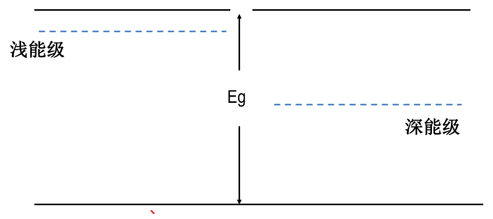
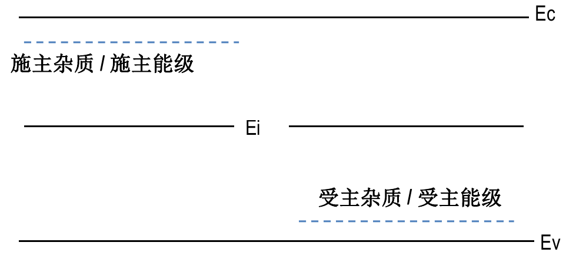
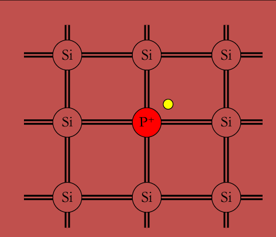
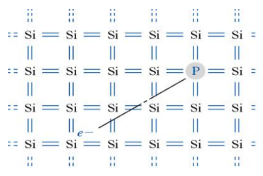
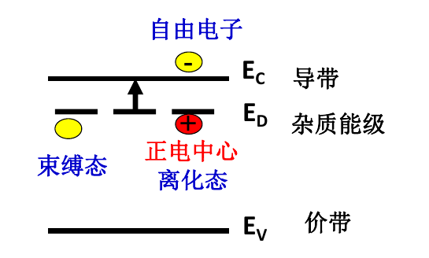
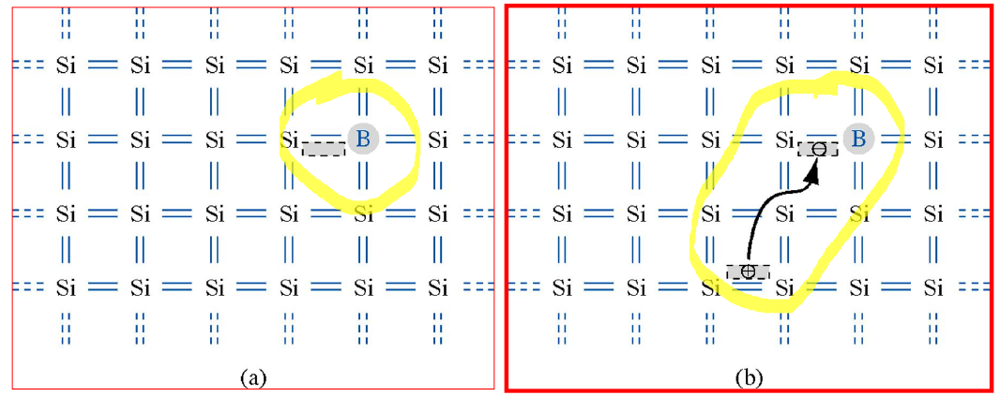

+++
date = '2024-10-11'
draft = false
title = '半导体中的杂质和缺陷能级'
tags = ['Science', 'Semiconductor']
+++
本征半导体：即为理想纯净半导体。
1. 晶体：原子严格周期性排列，具有完整的晶格结构
2. 晶体中无杂质无缺陷->禁带中无能级，电子只处在允带中

本征半导体的载流子只能由本征激发提供ref[[半导体中的电子状态#4. 本征半导体的导电机构——载流子|载流子]]

实际半导体含有杂质和缺陷，且原子在晶格位置热振动
因此会在禁带中引入能级，对半导体性质产生决定性影响。

# Si、Ge晶体中的杂质能级
## 杂质与杂质能级
杂质包含替位式杂质和间隙式杂质

间隙式杂质，杂质原子较小，位于间隙位置

替位式杂质，杂质原子与被代替原子的大小比拟，价电子壳层结构相似，杂质替位后处于格点位置

- 杂质分类：
  - 浅能级杂质
    - N型半导体
    - P型半导体
  - 深能级杂质
    - 复合中心
    - 陷阱

杂质能级根据在禁带中的位置不同，分为浅能级杂质和深能级杂质。
浅能级又分为施主杂质/施主能级和受主杂质/受主能级

## 施主杂质能级
以在Si中掺P为例

- 施主杂质：掺入的杂质原子电离时，释放电子而产生导电电子，并形成正电中心的杂质（又称N型杂质）。
- 施主能级$E_D$：被施主杂质束缚电子的能量状态（比导带底Ec低）。
- 施主电离能：$\Delta E_D = E_C-E_D$，是施主杂质中弱束缚的电子摆脱杂质原子束缚成为晶格中自由电子所需要的能量
  - 施主杂质的电离能小，在常温下基本上电离。

P原子替代Si原子，形成共价键，出现1个**正电中心P＋**（不可移动）和1个多余的**价电子**。

多余的价电子挣脱束缚，在晶格中自由运动→**杂质电离**；

用能带图表述施主杂质的电离过程：

电离结果：导致导带中的电子数增加——施主掺杂的意义。

- 含有施主杂质的半导体，其导电的载流子主要是电子

## 受主杂质能级
以Si中掺B为例

