+++
date = '2024-09-28'
draft = false
title = '半导体中的电子状态'
tags = ['Science', 'Semiconductor']
+++
# 1. 半导体的晶格结构和结合性质
## 1.1. 半导体材料
### 1.1.1. 什么是半导体材料
定义参考[半导体简介](../半导体简介/index.md)

半导体材料的类型：元素半导体Si Ge，化合物半导体GaAs InP等
### 1.1.2. 元素半导体材料
硅、锗都是由单一原子所组成的元素半导体，均为周期表第IV族元素。
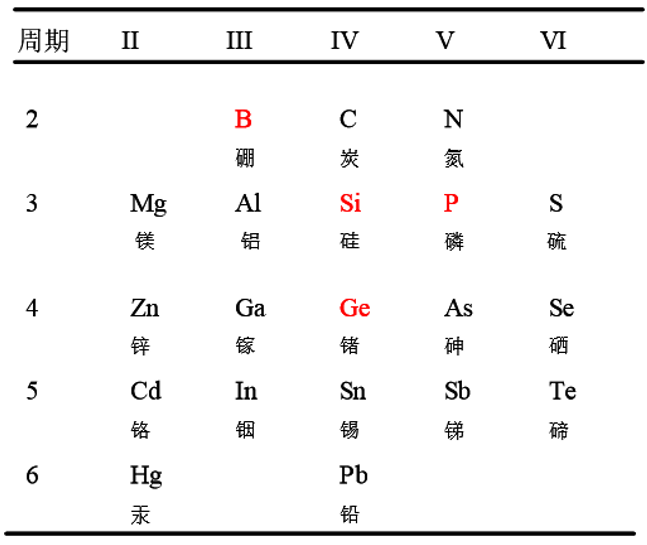
60年代Si取代Ge成为半导体制造的主要材料
硅的优势在于：室温下特性良好；高品质的硅氧化层可由热成长的方式产生，成本低；储量丰富。
### 1.1.3. 化合物半导体
有二元、三元、多元化合物半导体

二元化合物半导体：
IV－IV族化合物半导体：碳化硅（SiC）； III-V族化合物半导体：砷化镓（GaAs）、磷化镓（GaP）、磷化铟（InP）
II-VI族化合物半导体：氧化锌（ZnO）、硫化锌（ZnS）、碲化镉（CdTe）
IV-VI族化合物半导体：硫化铅（PbS）、硒化铅（PbSe）、碲化铅（PbTe）

多元化合物半导体：
具有 $A_xB_{1-x}C_yD_{1-y}$ 形式的四元化合物半导体。

**特性区别** ：
1. 与元素半导体有不同的电特性及光特性
2. 制作单晶化合物半导体的工艺更复杂

## 1.2. 晶格结构
### 1.2.1. 晶格简介：
1. 晶格：晶体中原子的周期性排列
2. 单胞：周期性排列的最小单元，代表整个晶格，
   将此单胞向晶体的四面八方连续延伸，即可产生整个晶格。
3. 特点：单晶体，三维空间周期性排列
    当原子热振动时，仍以其中心位置作微振动。

单胞及其表示

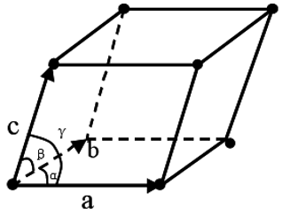
1. 晶格常数：单胞与晶格的关系用三个向量a、b及c表示，
   它们彼此之间不需要正交，而且在长度上不一定相同，称为晶格常数。
2. 每个三维空间晶体中的等效格点可用下面的向量组表示:  $\vec{R} = m \vec{a} + n \vec{b} + p \vec{c}$ 其中m、n、p是整数。 

### 1.2.2. 基本晶格结构
简单立方晶格：

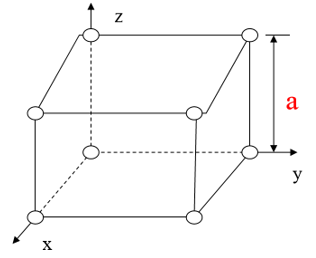

体心立方晶格：\
比如 Na， 钨

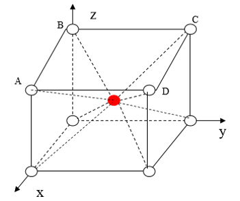

面心立方晶格：\
比如：Al，Co，Au，铂

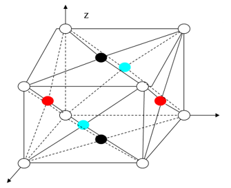

金刚石晶格结构：\
可以视为两个相互套构的面心立方副晶格，比如：Si Ge

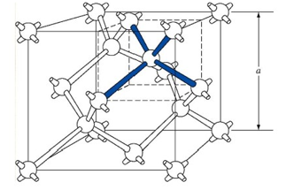

闪锌矿结构：\
与金刚石晶格结构类似，只是两个相互套构的面心立方副晶格中的组成原子不同。\
大部分III-V族化合物半导体具有闪锌矿结构，如GaAs晶体。

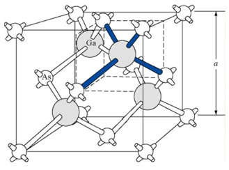

### 1.2.3. 米勒指数
不同平面的原子空间位置不同，沿着不同平面的晶体特性也不同，器件特性与晶体方向有着极其重要的关联。

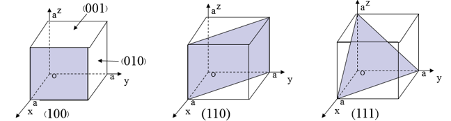

*米勒指数* 是截距的 **倒数**\
一些规定：
1. $(\bar{h}kl)$ ：代表x轴上截距为负的平面
2. {hkl}：代表相对称的平面群，如：在立方对称平面中，
   可用{100}表示(100)，(010)，(001)， $(\bar 100)$，$(0\bar 10)$，$(00\bar 1)$ 六个平面。
3. [hkl]：代表晶体方向，如[100]方向定义为垂直于(100)平面的方向，
   即表示x轴方向，而[111]则表示垂直于(111)平面的方向。
4. <hkl>：代表等效方向的所有方向组，
   如<100>代表[100]、[010]、[001]、$(\bar 100)$、$(0\bar 10)$、$(00\bar 1)$ 六个等效方向的族群。

## 1.3. 半导体的共价键结合
### 1.3.1. 共价键形成条件
在 *两个向塘元素原子* 或 *具有相似外层电子结构* 的不同原子间。

每个原子核拥有每个电子的时间相同，原子核对电子的吸引力使得两个原子结合在一起
### 1.3.2. 金刚石晶格结构
金刚石晶格结构：每个原子被4个最邻近的原子所包围（二维空间结构简图如下）。每个原子在外围轨道有4个电子，分别与周围4个原子共用4对电子。 *这种共用电子对# 的结构称为共价键。每个电子对组成一个共价键。

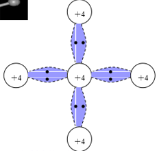
### 1.3.3. 闪锌矿结构
主要结合也是共价键，但在化合物晶体中还存在微弱离子键成分，如GaAs晶体中的Ga+离子与其四个邻近As-离子，或As-离子与其四个邻近Ga+离子间的静电吸引力。

### 1.3.4. 载流子
半导体中可移动的电子与空穴统称为载流子。 低温时，晶体中的电子被共价键束缚在晶格中，无法作电的传导。 高温时，热振动可以打断共价键。当一些键被打断时，所产生的自由电子参与电的传导。而1个自由电子产生时，会在原处留下1个空位。此空位可被邻近的1个电子填充，从而产生空位位置的相对移动，此空位可被看作与电子运动方向相反的正电荷，称为空穴(hole)。

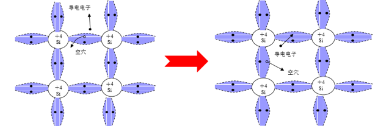

# 2. 半导体中的电子状态和能带
## 2.1. 电子的共有化运动
### 2.1.1. 孤立原子中的电子状态
孤立原子中电子能级量子化
电子壳层：1s 2s 2p 3s 3p 3d 4s…
- 能量最低原理（电子填充）
- 泡利不相容原理（自旋状态）

电子状态通过 n主量子数，l轨道量子数，ml磁量子数，ms自旋量子数 确定。

孤立氢原子的玻尔能级模型：
$$E_H=-\frac{m_0q^4}{8\varepsilon_0{}^2h^2n^2}=-\frac{13.6}{n^2}eV$$

### 2.1.2. 晶体中的电子状态：电子的共有化运动
1. 原子组成晶体后，由于相邻原子的“相似” *电子壳层发生交叠# ， 电子不再完全局限在特定原子上，可以由一个原子转移到相邻的原子上，因而，电子将可以在整个晶体 *相似壳层间运动# 。
2. 内层电子共有化程度弱。
3. 原子钟相似壳层上的电子才有相同的能量，电子只能在相似壳层之间转移。

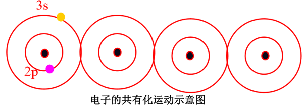

## 2.2. 能带的形成（导带、价带、禁带）
- 能带的形成是晶体中电子共有化运动的必然结果。
- *共有化运动 → 能级分裂 → 形成能带*
  - 两个原子相互靠近时，每个原子中的电子除受到本身原子的势场作用外，还要受到另一个原子势场的作用。其结果是每个二度简并的能级都分裂为两个彼此相距很近的能级。

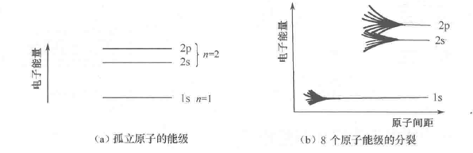

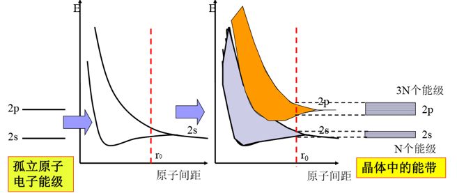

### 2.2.1. 能级与能带对应关系
- 内层电子共有化运动弱，能级分裂小，能带窄；外壳层电子共有化运动显著，能带宽。
- 能带中能量不连续，晶体原子数很多，能带视为准连续；每个能带中的能级数目与晶体中的原子数有关。

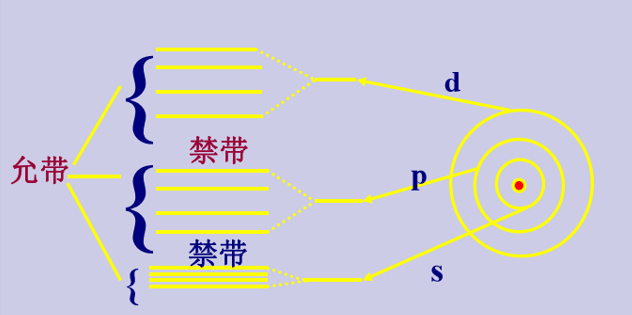

禁带宽度Eg：导带底部与价带顶部间的能量间隔(EC-EV)，表示将半导体价带中的电子断键变成自由电子跃迁到导带（在价带中留下1个空穴）所需能量。
### 2.2.2. 价电子与能带的对应关系
- 成键电子对应于价带
- 自由电子对应于导带

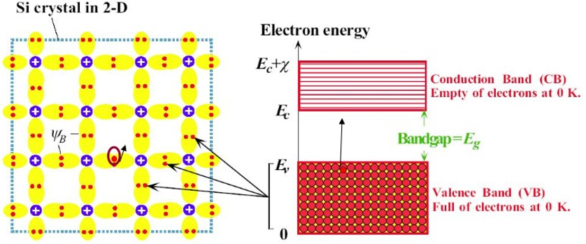
- 本征激发：价带电子激发成为导带电子的过程
### 2.2.3. 导体、绝缘体和半导体的能带特点

常温下：

Si：Eg=1.12eV

Ge: Eg=0.67eV

GaAs: Eg =1.43eV

## 2.3. 半导体电子状态与能带
即E(k) - k 的关系。
### 2.3.1. 自由电子的运动状态
电子在周期性势场中运动的基本特点和自由电子的运动十分相似。可以先考虑[自由电子的运动状态](../自由电子的运动状态/index.md)

### 2.3.2. 晶体中电子的运动：布里渊区

[布里渊区](../布里渊区/index.md)

对于有限晶体, 考虑周期性边界条件. 对边长为L的立方体, 波矢的三个分量分别为:
$$k_{x}=\frac{2\pi n_{x}}{L}\quad(n_{x}=0,\pm1,\pm2,\cdots)\\k_{y}=\frac{2\pi n_{y}}{L}\quad(n_{y}=0,\pm1,\pm2,\cdots)\\k_{z}=\frac{2\pi n_{z}}{L}\quad(n_{z}=0,\pm1,\pm2,\cdots)$$
可见波矢$\vec k$只能取分立的数值, 具有量子数的作用, 描述晶体中电子共有化运动的量子状态.

每个布里渊区的k状态数为固体物理学中的原胞数N. 因为每个能级可以容量两个自旋相反的电子, 所以每个能带可以容纳2N个电子.

布里渊区也可以通过画倒格子获得.

# 3. 半导体中电子的运动与有效质量
## 3.1. 意义
$$F_外+F_内=m_0a\\
F_外 = m_n^*a $$
- 有效质量概括了半导体内部势场作用
- 引入有效质量,研究半导体中电子运动时, 可不涉及半导体内部势场作用.

## 3.2. 回顾自由电子 牛顿力学描述
[[自由电子的运动状态|自由电子的运动状态]]
$$E = \frac 1 2 \frac{p^2}{2m_0} = \frac{\hbar ^2 k^2}{2m_0}$$
对$E_k$微分得到:
$$\frac{\mathrm d E}{\mathrm d k} = \frac{\hbar^2 k}{m_0}$$

速度 :
$$v_k = \frac{p}{m_0} = \frac{\hbar k }{m_0}$$

因此,对比可知:
$$ v_k = \frac 1 \hbar \frac{\mathrm d E}{\mathrm d k}$$

外力做功和能量关系可得:(标量化)
$$\mathrm d E = \vec F \cdot \mathrm d \vec s  = \vec F \cdot \vec v \mathrm d t\\
\frac{\mathrm d E}{\mathrm d t}= F \frac 1 \hbar \frac{\mathrm d E}{\mathrm d k}$$

因此:
$$F = \hbar\frac{\mathrm dk}{\mathrm dt}$$

又:
$$a = \frac{\mathrm dv}{\mathrm dt} = \frac{\frac \hbar m_0 \mathrm dk}{\mathrm dt} = \frac F m_0$$

## 3.3. 半导体中电子 牛顿力学描述
考虑导带底或价带顶的电子状态, 以一维情况为例($E(k)$在$k=0$处取得极值), 在极值附近按泰勒级数展开:
$$E(k)=E(0)+\left(\frac{d E}{d k}\right)_{k=0} k+\frac{1}{2}\left(\frac{d^{2} E}{d k^{2}}\right)_{k=0} k^{2}+\ldots \ldots$$

极值处一阶导数为0, 舍弃高阶项:
$$E(k)-E(0)=\frac{1}{2}\left(\frac{d^{2} E}{d k^{2}}\right)_{k=0} k^{2}$$

**定义有效质量**:
$$\frac 1 {m_n^*} = \frac 1 {\hbar^2}\left( \frac{d^{2} E}{d k^{2}}\right)_{k=0}$$

此时
$$E(k)-E(0)=\frac{\hbar^2 k^2}{2m_n^*}$$
与自由电子能量表达式类似.

称$m_n^*$为电子有效质量
$$ m_n^*= \frac{\hbar^2}{\frac{\mathrm d^2 E}{\mathrm d k^2}}$$

## 3.4. 有效质量的特点
1. 取决于材料
2. 与能带有关: 内层带窄$\frac{\mathrm d^2 E}{\mathrm d k^2}$小, 有效质量大; 外层带宽$\frac{\mathrm d^2 E}{\mathrm d k^2}$大, 有效质量小
   >外层电子在外力作用下可以获得较大的加速度
3. 有效质量有正负之分.

第一布里渊区的能量、速度、有效质量如图：
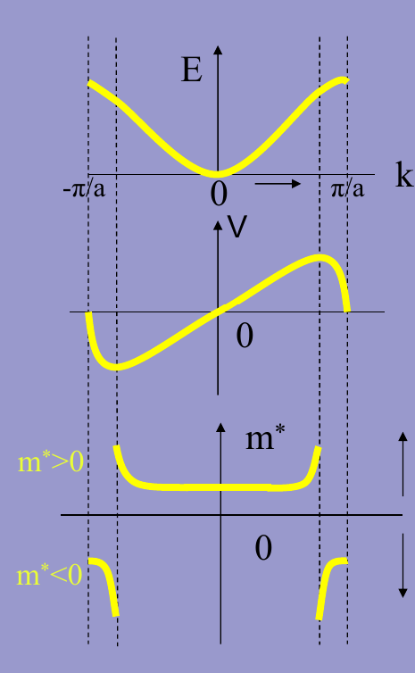

# 4. 本征半导体的导电机构——载流子
满带时无法导电，不满带时才对电流有贡献

绝对零度时，价带被价电子填满，导带是空的，不导电。

电子：带负电的导电载流子。是价电子脱离原子束缚后形成的自由电子，对应于导带中占据的电子。\
空穴：带正电的导电载流子。是价电子脱离原子束缚后形成的电子空位，对应于价带中的电子空位。

本征半导体中，导带上出现的电子数目与价带上出现的空穴等量，他们均参与导电
## 4.1. 载流子的产生
1. 光激发产生
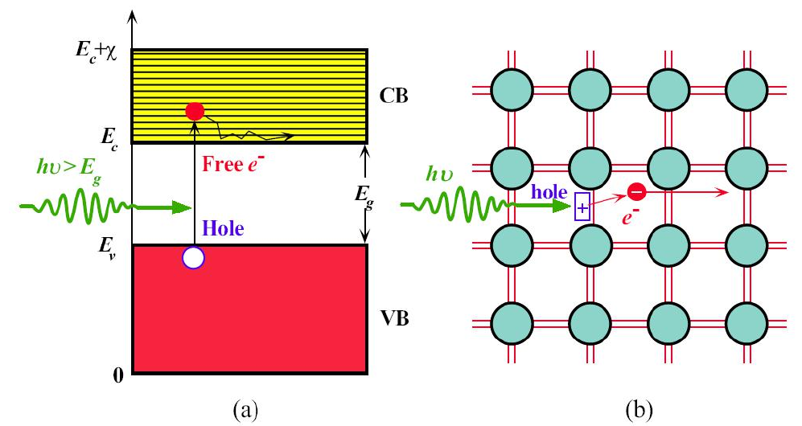
a. 大于禁带宽度的光子可以将电子从价带激发到导带。
b. 光子打破硅硅连接，在连接处产生自由电子和空穴

2. 热振动产生
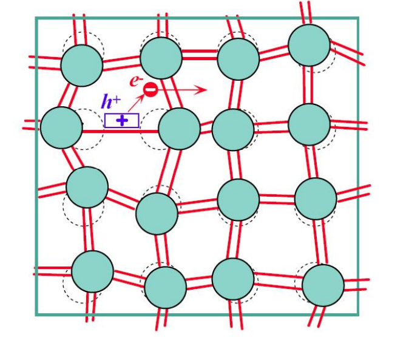
热振动破坏连接，因此产生电子空穴对。

## 4.2. 半导体中空穴的状态
$$
\begin{array}{l}
k_{p}=-k_{e} \\
E\left(k_{p}\right)=-E\left(k_{e}\right) \\
v\left(k_{p}\right)=v\left(k_{e}\right) \\
m_{p}^{*}=-m_{e}^{*} \\
a=F / m_{p}^{*}
\end{array}
$$
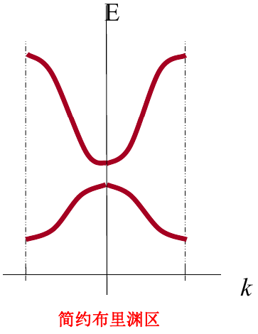
