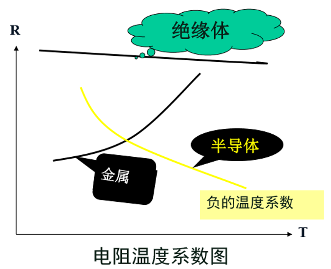
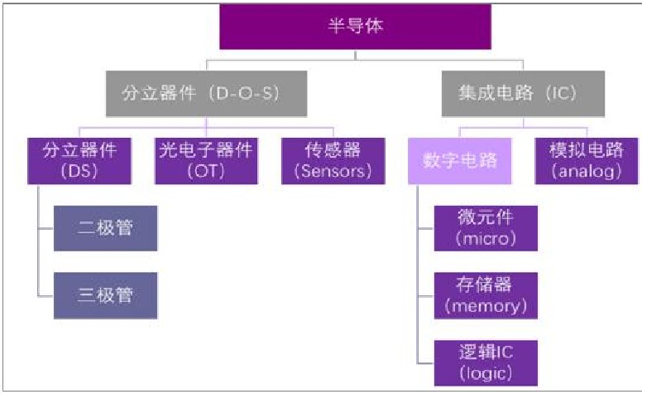

+++
date = '2024-09-28'
draft = false
title = '半导体简介'
tags = ['Science', 'Semiconductor']
+++
# 什么是半导体
1. 半导体：电阻率 $\rho$ 介于导体和绝缘体之间，*并且具有富的电阻温度系数*

2. 从导电性，固体材料可分成：
   - 超导体
   - 导体
   - 半导体 
   - 绝缘体

3. 电阻率：
   - 导体：$\rho < 10^{-4}\Omega\textrm{cm}$ ，如 $\rho_{Cu} = 10^{-6}\Omega\textrm{cm}$
   - 半导体：$10^{-3}\Omega\textrm{cm} < \rho < 10^8\Omega\textrm{cm}$ ，如 $\rho_{Ge} = 0.2\Omega\textrm{cm}$
   - 绝缘体： $\rho > 10^8\Omega\textrm{cm}$

4. 微电子=集成电路=芯片<半导体

# 半导体材料的基本特性
半导体材料是微电子和光电子技术的基础，用半导体材料制作（光）电子元器件，不是因为它的导电能力介于导体和绝缘体之间，而是由于其导电机理不同于其它物质，*其导电能力可调谐*。
- 当受外界热、光、磁、压力、电压变化等作用时，它的导电能力明显变化。
  - 热电特性、光电特性、磁阻效应、压电效应、电光效应等
- 往纯净的半导体中掺入某些杂质，会使它的导电能力明显改变。
  - 掺杂特性

半导体材料的性质主要取决于半导体的能带结构和电子的运动规律。