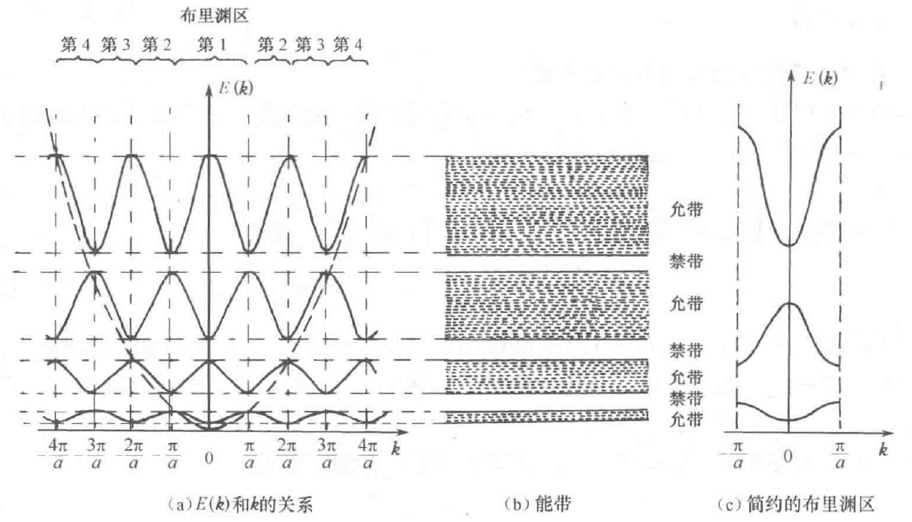

+++
date = '2024-10-10T15:14:25+08:00'
draft = false
title = '布里渊区'
tags = ['Science', 'Semiconductor', 'Condensed']
+++

ref:半导体物理刘恩科

# 半导体

晶体中的电子是在具有周期性的等效势场中运动——单电子近似

晶体中电子的波动方程:
$$\left[-\frac{\hbar^2}{2m}\nabla^2+V(r)\right]\psi=E\psi $$

> 布洛赫定理——当势场具有周期性时，波动方程的解具有如下布洛赫波函数的形式：
$\psi(r)=u(r)e^{i2\pi kr}$
- 相位因子反映电子的共有化运动。
- u(r) 反映周期势场对共有化运动的影响，具有和晶格一样的周期性。$u(r)=u(r+R_n)$

电子在晶体中的分布$\begin{vmatrix}\psi(r)\end{vmatrix}^2=\left|\psi \psi^{\*}\right|=\begin{vmatrix}u(r)u(r)^*\end{vmatrix}$
- 电子在晶体中的分布几率是晶格的周期函数
- 晶体中各处分布几率不同，但不同原胞的等价位置上出现的几率相同。
---
- 电子不再局限与某一个原子上，而可以从晶胞中某一点自由运动到其他晶胞的等价位置，因而电子可以在整个晶体中运动（共有化运动）
- 外层电子的共有化运动程度强，与自由电子相似，称为准自由电子；内层电子的共有化运动程度弱，与孤立原子中的电子相似
- 波矢$\vec k$同样描述晶体中电子的共有化运动状态

求解上述薛定谔方程可得如图解的形式,当
$$k=\frac{n\pi}{a}\quad(n=0,\pm1,\pm2,\cdots)$$
时能量出现不连续, 形成一系列允带和禁带.**一个允带对应的k值范围称为布里渊区**.

# 固体物理
已经忘了，待补充