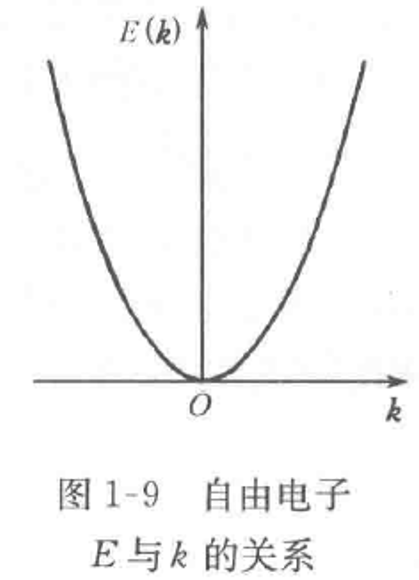

+++
date = '2024-09-28'
draft = false
title = '自由电子的运动状态'
tags = ['Science', 'Quantum']
+++

自由粒子用平面波表述（德布罗意）
$$\Phi(\vec r,t)=A\mathrm{e}^{\mathrm{i}(\vec k \bullet \vec r-\omega t)}$$
考虑一维情况：
$$\begin{aligned}\Phi(x,t)=&A\mathrm{e}^{\mathrm{i}kx}\mathrm{e}^{-\mathrm{i}at}=\Psi(x)\mathrm{e}^{-\mathrm{i}at}\\\Psi(x)=&A\mathrm{e}^{\mathrm{i}kx}\end{aligned}$$
后式为自由粒子波函数，代表沿x方向传播的平面波，且遵守定态薛定谔方程
$$-\frac{\hbar^2}{2m_0}\frac{\mathrm{d}^2\Psi(x)}{\mathrm{d}x^2}=E\Psi(x)$$

再考虑
$$\vec p = \hbar \vec k $$
可得
$$ E = \frac{\hbar ^2 k^2}{2m_0}$$

波矢$\vec k$用于描述自由电子的运动状态。图中可以看出一维情况下自由电子的能量是连续的。

空间分布$\left|\psi(r)\right|^2=\left|\psi\psi^*\right|=A^2$

自由电子在空间是等几率分布的, 自由运动。
